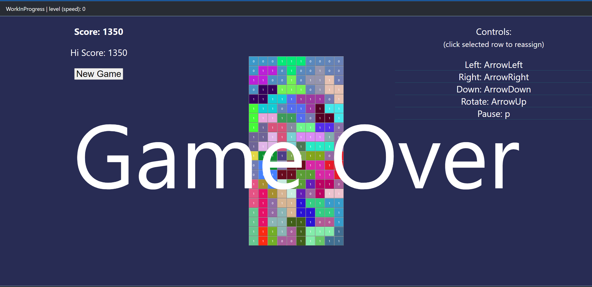

# Solid Tetris

This is a simple Tetris game written in TS/[Solidjs](https://solidjs.com).

Just to practise and fun.

This is still work in progress, until I will have the time, ideas and strength to add new features:)

## Usage of the project

Pretty standard workflow:

``` bash
* git clone repo
* cd into/folder
* npm install
* npm run dev
```

## Playing the game

Pretty standard tetris by default:

* Arrows left/down/right to move,
* Arrow up to rotate
* p to pause

But you can rearrange according to your preferences.

### Autopause

Whenever the game window loses focus, the game is automatically paused.

### Game save

If you close the window or reload the page during in-game, the save would be created.
When you later get back to the game and the save would be discovered, you'll see modal
window with question whether you want to load it.

Save will be only created if
another is not present already or if the game is in progress (not in game over state).

### Game modes

Now we have something completely new - game modes!

* Classic - you play as you did since begining - every 5000pts, game speeds up;
* Endless - you can play without any speed ups, with the constant drop speed, (almost) endless;
* Arcade - while playing in endless mode, there will be some perks drawn on each full lines you've cleared.

## Example video of a new arcade mode


## Example WIP Screen



## Working game

You can see the game in action deployed on [github pages](https://pawel-mika.github.io/solid-tetris/). Enjoy!
