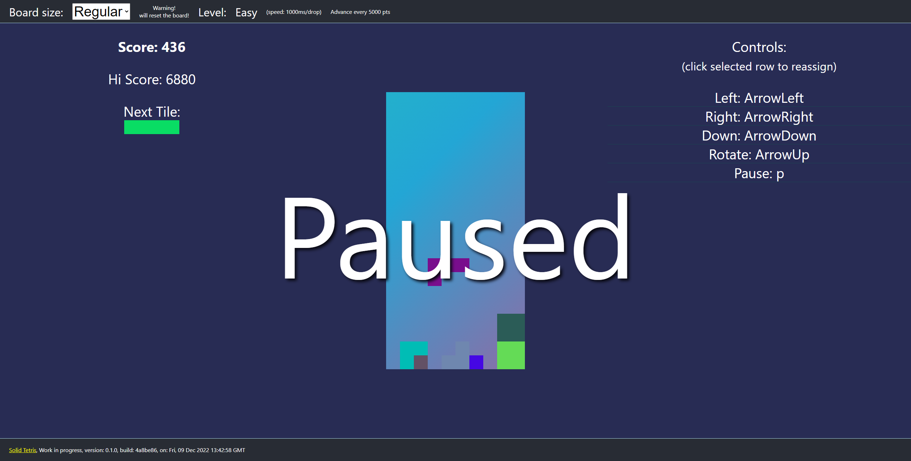

# Solid Tetris

This is a simple Tetris game written in TS/[Solidjs](https://solidjs.com).

Just to practise and fun.

This is still work in progress, until I will have the time, ideas and strength to add new features:)

## Usage of the project

Pretty standard workflow:

``` bash
* git clone repo
* cd into/folder
* npm install
* npm run dev
```

## Playing the game

Pretty standard tetris by default:

* Arrows left/down/right to move,
* Arrow up to rotate
* p to pause

But you can rearrange according to your preferences.

## Example WIP Screen


